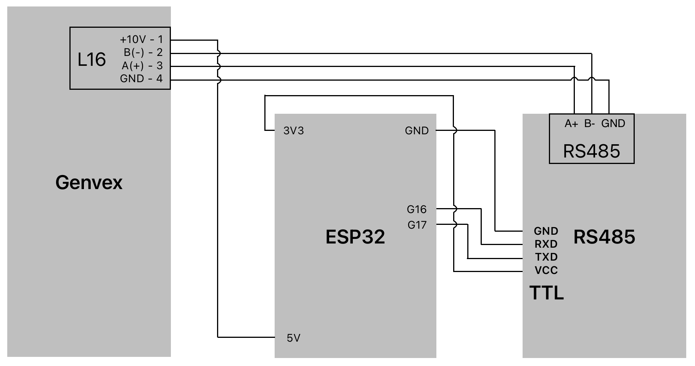

## Genvexv2

Updated version of Genvex modbus controller  

Supported Genvex Control units

|Controller     | Support   | Tested |
|---------------|:---------:|:------:|
|Optima 250     | x         | x      |
|Optima 251     |           |        |
|Optima 260     | x         | x      |
|Optima 270     | x         | x      |
|Optima 301     |           |        |
|Optima 310     |           |        |
|Optima 311-312 |           |        |


### Setting up ESP32
Guide on how to setup you ESP32 to Genvex unit via modbus

You will need a ESP32 and a board to convert from UART on RS485 used to communicate wiht Genvex over modbus
- [ESP32 Development Board](https://www.aliexpress.com/item/32834130422.html?spm=a2g0o.order_list.order_list_main.5.21ef1802NUOVTF)
- [TTL to RS485 Converter 3.3V/5.0V](https://www.aliexpress.com/item/32846149743.html?spm=a2g0o.order_list.order_list_main.28.21ef1802NUOVTF)

<b>Connection diagram</b>
Connect the components as shown on the diagram below.



**Note:**
Don't connect the ESP32 to Genvex 10V Power supply on <em>L16.1</em> and a USB device at the samt time!!!
If you do so Genvex 10V and your USB device will be connected and properly just blow a fuse in Genvex unit or have a USB port not working :|

### Yaml configuration

Example of yaml file for Genvex ECO180 using <em>optima260.yaml</em>
```
esphome:
  name: genvex
  friendly_name: Genvex 

esp32:
  board: esp32dev
  framework:
    type: arduino

# Enable logging
logger:

# Enable Home Assistant API
api:
  encryption:
    key: "<a secret encryption key>"

ota:
  password: "<secure passwors>"

wifi:
  ssid: "<Your home Wifi>"
  password: "<Your home Wifi Password>"

  # Enable fallback hotspot (captive portal) in case wifi connection fails
  ap:
    ssid: "Genvex Fallback Hotspot"
    password: "<secret password>"

captive_portal:

## Genvex V2 file    
packages:
  remote_package:
    url: https://github.com/lskov/esphome_components
    ref: main
    files: [components/genvexv2/optima260.yaml]
    refresh: 0s

uart:
  - id: uart_genvex
    rx_pin: GPIO16
    tx_pin: GPIO17
    parity: EVEN
    baud_rate: 19200
    stop_bits: 1
  
modbus:
    - id: genvex_modbus
      uart_id: uart_genvex
 
modbus_controller:
  id: genvex_modbus_controller
  address: 1
  modbus_id: genvex_modbus
  update_interval: 60s
  command_throttle: 10ms
```